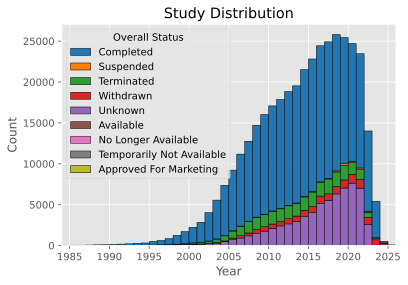

# Predictive Analysis on Clinical Trial Outcomes

Clinical trials for Investigational New Drugs (IND) are a significant driver of healthcare costs in the United States. Individual. A single clinical trial has a [median estimated cost of US\$ 19 million](https://bmjopen.bmj.com/content/10/6/e038863). A pivotal Phase III clinical trial has an estimated cost from [US\$ 48 million](https://bmjopen.bmj.com/content/10/6/e038863) up to [US\$ 255 million](https://doi.org/10.1016/j.jhealeco.2016.01.012) and bringing a new drug to market requires multiple trials through three phases of increasing complexity and costs an estimated [US\$ 2.6 billion](https://doi.org/10.1016/j.jhealeco.2016.01.012). Factors contributing to additional cost include [protocol amendments](https://pubmed.ncbi.nlm.nih.gov/30227022/), trial [design and decision making](https://aspe.hhs.gov/reports/examination-clinical-trial-costs-barriers-drug-development-0), and [data management](https://www.ncbi.nlm.nih.gov/pmc/articles/PMC4386950/).

Registration of clinical studies including protocols and results on ClinicalTrials.gov become compulsory for clinical trials ongoing at the end of 2007. The database became available to the public in 2008.

    

ClinicalTrials.gov holds a wealth of knowledge about clinical trials and how they are conducted, including the final outcome status for trials. The project aims to lay the initial groundwork for predictive analysis that will inform study protocol design, and decision-making to align with practices associated with higher success in completing clinical trials.

### Project Goals
1. Identify data features within ClinicalTrials.gov that may predict clinical trial completion
    * Features of study design and protocol prior to initiation
    * Features that may be monitored as clinical trials progress
2. Develop a predictive model for clinical trial completion vs. suspension, termination, withdrawal, or abandonment
    * Achieve predictive results better than the baseline mean

### Assumptions and Limitations

The ClinicalTrials.gov database is designed for public access to information, not predictive modeling. Fields within the database may be updated before, during, or after the completion of the study. Ideally, this analysis could be limited to inputs known prior to study initiation, however, the sequence of these inputs and changes is not necessarily known.

Field selection for initial download and inclusion was intended to represent study design and protocol decision-making. A more thorough audit of field edit timestamps and previous values with subject matter expertise of the clinical trials submission and record keeping-process was not available within the limited scope of this project. It is possible that data leakage may occur for fields that have been updated during or after study completion.

## Data Source

All data used in this analysis were downloaded and derived from the [ClinicalTrials.gov](https://clinicaltrials.gov/) API v2, which provides a public database of US clinical studies. Full documentation is available on the ClinicalTrials.gov website. The information structure and query syntax used in this project are guided by the [API documentation](https://clinicaltrials.gov/data-api/api) and [ESSIE query syntax](https://clinicaltrials.gov/find-studies/constructing-complex-search-queries), which was [developed specifically for the ClinicalTrials.gov project at the NLM](https://doi.org/10.1197/jamia.M2233) for in silico biomedical literature research.

Comprehensive documentation is available on the ClinicalTrials.gov website
- [API documentation](https://clinicaltrials.gov/data-api/api)
- [Data structure](https://clinicaltrials.gov/data-api/about-api/study-data-structure)
- [ESSIE query syntax](https://clinicaltrials.gov/find-studies/constructing-complex-search-queries)

115 data fields were initially selected for download and exploratory analysis from the 568 documented API fields. These 115 fields are defined in the included [inscope_fields.txt](./inscope_fields.txt) file. From these 115 fields, 69 were selected for encoding and predictive modeling.

| Field Type | No. Fields |
| - | :-: |
| Target `OverallStatus` (categorical) | 1 |
| Categorical | 37 |
| Numerical | 12 |
| String | 19 |

## Executive Summary

Analysis of 383,135 clinical study records revealed a wealth of information in ClinicalTrials.gov with utility to industry. The nature of the data made it difficult to determine which fields may represent information known before, during, or after a study has been conducted. Additional subject matter expertise in clinical trial data management would be beneficial for furthering these studies and enabling the true predictive power of these data.

### Model results

All models developed were able to successfully predict study completion better than baseline. Traditional logistic regression and Neural Network models performed similarly. The complex neural network approach was able to slightly outperform all other models. Both neural network models were able to outperform the logistic progression models in terms of accuracy and balanced accuracy without the need for SMOTE. It's notable, that the compute time required to train the basic neural networks was lower than that of the logistic regression models while achieving comparable, or slightly higher performance.

| Model | Accuracy Score | Balanced Accuracy Score | Train Time |
| - | :-: | :-: | :-: |
| *Baseline* | *70.7%* | | |
| Logistic Regression | 90.9% | 84.8% | 50s |
| Logistic Regression with SMOTE | 89.5% | 85.7% | 381s |
| Basic Neural Network | 91.2% | 86.0% | 21s |
| Complex Sequential Neural Network | 91.4% | 86.0% | 187s |

### Conclusion
- Given additional resources, further analysis could help guide the design and implementation of clinical trials as well as provide a predictive model of ongoing study health and future study success.
- A full retrospective analysis of study design and reported results could identify specific approaches associated with clinical trial success.
- Snapshots of the comprehensive set of trial data at multiple time points during study planning and throughout implementation would improve predictive power and prevent data leakage.
- Integration of additional data sources connecting the development of health interventions across multiple studies and ultimate product marketability would be instrumental for continued research. 
- NLP analysis of free-text fields, particularly regarding detailed protocol design and trial results may yield additional benefits.
